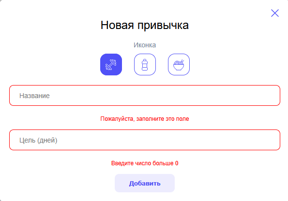
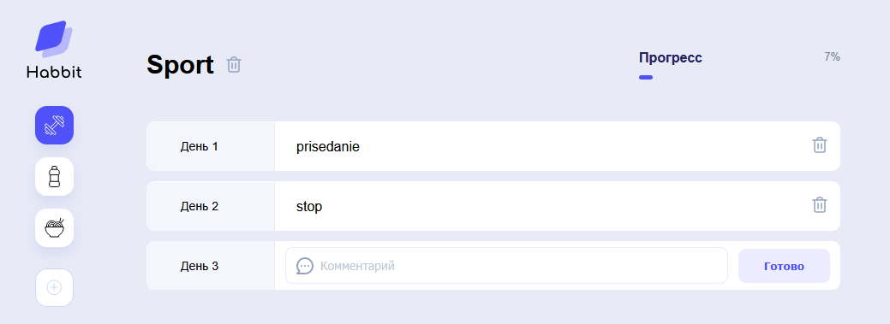

# 📋 Habbit Tracker

<p align="left">
  
  
  
</p>

Веб‑приложение для эффективного отслеживания ежедневных привычек и целей.  
Построено на **Vue 3 + Pinia + Vite** с автосохранением и адаптивным интерфейсом.

---

## 📸 Скриншоты

|      Главный экран      |    Модалка + прогресс    |
| :---------------------: | :----------------------: |
|  |  |

---

## ✨ Возможности

- ➕ Добавление привычек с выбором иконки и цели
- 📊 Автоматический расчёт прогресса (процент выполнения)
- 📅 Добавление комментариев к дням
- ✏️ Редактирование названия привычки
- 🗑️ Удаление привычек и отдельных дней
- 💾 Автосохранение в `localStorage` (Pinia persist)
- 📱 Адаптивный интерфейс (Naive UI)

---

## 🛠 Технологии

| Технология                      | Назначение            |
| ------------------------------- | --------------------- |
| **Vue 3**                       | реактивный фреймворк  |
| **Pinia**                       | управление состоянием |
| **Pinia Plugin Persistedstate** | автосохранение        |
| **Vite**                        | сборка проекта        |

## 📁 Структура проекта

```text
src/
├── components/          # UI-компоненты
│   ├── AddHabitModal.vue   # модалка добавления привычки
│   ├── DaysList.vue        # список дней и форма добавления
│   ├── EditableInput.vue   # редактируемое поле
│   ├── HabitButton.vue     # кнопка привычки
│   ├── HeaderStats.vue     # заголовок и прогресс
│   └── Sidebar.vue         # боковая панель
├── img/                 # SVG-иконки
├── stores/              # Pinia-сторы
│   ├── habitStore.js    # привычки, дни, прогресс
│   ├── uiStore.js       # состояние интерфейса (модалка, редактирование)
│   └── dayStore.js      # форма добавления дня
├── assets/              # глобальные стили (CSS-переменные)
├── App.vue              # корневой компонент
└── main.js              # точка входа
```

## 🚀 Установка и запуск

1. Клонируйте репозиторий:

```bash
git clone https://github.com/rakhzar/habbit.tracker.git
cd habbit.tracker
```

2. Установить зависимости

```bash
npm install
```

3. Запустите дев-сервер

```bash
npm run dev
```

4. Откройте https://localhost:5173 в браузере
